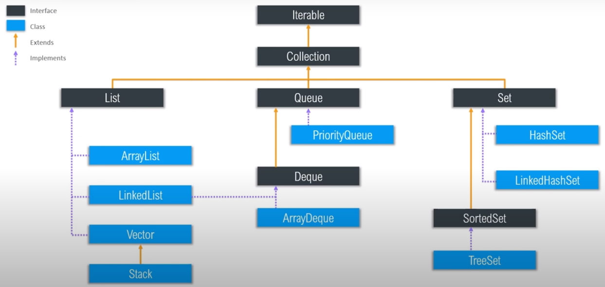
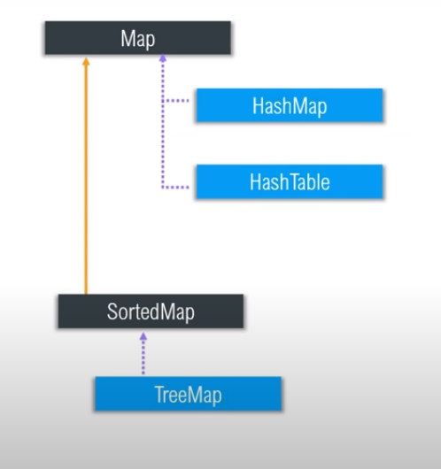

### Useful Intellij Shortcuts

* `double tap shift`: Search anything in project. 
* `ctrl + shift + enter`: Complete current statement.
* `ctrl + /`: Comment line.
* `ctrl + shift + /`: Comment block.
* `hold ctrl + click`: goto declaration/definition.
* `alt + enter`: show intended actions for error fix.

# Java Documentation

Get Class Type

### Get Class Type

    String x = "123";
    
    System.out.println(x.getClass()); // prints: class java.lang.String 
    System.out.println(x.getClass().getSimpleName()); // prints: String 
    System.out.println(x instanceof String); // prints: true

### Strings

    System.out.println("apple".compareTo("banana")); // prints: -1
    System.out.println("apple".compareTo("apple")); // prints: 0
    if ("apple" == "apple") {} // Compares addresses of strings
    if ("apple".equals("apple")) {} // Compares values of strings

### Open Closed Principle
Open closed principle states that, a class is `open for extention` and `Closed for modification`.
The example below shows a convert class with a `convertToXML()` method. lets say we have to add a much better method called `convertTOJSON()`. So we can add another function in the same class which is against the open closed principle as we are modifying the class. The class could be an alrady tested class and we may add a bug by modifying it. so we can extend it and add another class that holds `convertToJSON()` function.

    public class Convert {
    
        public void ConvertToXML() {
            System.out.println("Converting data to XML");
        }

        // public void ConvertToJSON() {} // Against OPEN CLOSED PRINCIPLE
    
    }

    public class ConvertToJson extends Convert {
    
        public void convertToJSON() {
            System.out.println("Convert data to JSON");
        }
    
    }

### Boxing / Unboxing

Boxing and Unboxing is explained in the example below.

    public class Person {
    
        protected String name;
    
        public String getName() {
            return this.name;
        }
    
    }

    public class Employee extends Person {
    
        private int salary;

        public int getSalary() {
            return salary;
        }
    
    }

    public static void main(String[] args) {
	// write your code here

        // Normal Instantiations
        Person P = new Person();
        Employee E = new Employee();

        // Instantiations with parent classes/interfaces.
        Object OP = new Person(); // Object is the parent of every class.
        Person PE = new Employee();

        // Accessing methods
        P.getName(); // allowed
        P.getSalary(); // getSalary() is a method in employee, not allowed (error)
        O.getName(); // Not allowed.

        // To make a parent object access the child's method, use typecasting
        ((Person)O).getName(); // Now this will work.
        ((Employee)P).getSalary(); // Now this will work.
        
    }

### Collections

`Java Collection Framework`: Collections are the containers that group multiple items in a single group. Store and manipulate data at realtime.

`Collection Framework Hierarchy`: The images below shows the hierarchy:

* #### ArrayList
  
      // Store only Integers
      ArrayList<Integer> integerList = new ArrayList<Integer>();
      integerList.add(1);
      integerList.add(2);
      integerList.add(3);
      integerList.add(4);
      integerList.add(5);
  
      // Store dynamic data
      ArrayList list = new ArrayList(); // OR // ArrayList<Object> list = new ArrayList<Object>();
      list.add("osama");
      list.add(21);
      list.add(12.90);
  
      // Printing
      System.out.println("Integer List: " + integerList);
      System.out.println("Integer List: " + list);
  
      // getting data from arraylist
      int age = integerList.get(0);
      Object data = list.get(0); // using object since we don't know the type.
      System.out.println(age + " " + data);
  
      // Updating values
      list.set(0, "hadi");
      System.out.println("New List: " + list);
  
      // Contains function
      System.out.println(list.contains(12.9));
  
      // iteration
      for (short i = 0; i < list.size(); i++) {
          System.out.print(list.get(i) + " ");
      }
  
      // iteration using enhanced for loop
      for (Object o : list) {
          System.out.print(o + " ");
      }
  
      // printing using iterator
      Iterator<Integer> it = integerList.iterator();
      // System.out.print(it.next() + " ");
      // System.out.print(it.next() + " ");
      // System.out.print(it.next() + " ");
  
      // iterating through interator, removing element
      while (it.hasNext()) {
          int num = it.next();
          if (num == 4) {
              it.remove();
          }
      }
      System.out.println(integerList);

* #### HashMap
  
      // Creating hashmap
      // It contains other functions just like arraylist.
      // Hashmaps do not have an order
      HashMap<String, Integer> hm = new HashMap<String, Integer>();
      hm.put("osama", 123);
      hm.put("hadi", 12);
      hm.put("aamir", 1);
      System.out.println(hm);
      System.out.println(hm.get("hadi"));
      hm.remove("aamir");
      System.out.println(hm);
      System.out.println(hm.containsKey("osama"));
      System.out.println(hm.containsValue(123));
      hm.replace("hadi", 3434);
      System.out.println(hm);
      System.out.println(hm.keySet());

### Generics

### Composition Code Example

    class Floors {
      int rooms; // just for understanding
    }
    
    class Building {

        // this should be final.
        private final Floors[] floors;
        
        // Creating instance inside class. Cannot be passed through args.
        public Building() {
            this.floors = new Floors[5];
        }
    }

### Aggregation Code Example

    class Door {
        int hp;
    }
    
    class Car {
        // Not final
        private Door[] doors;
    
        // Passing doors from args for aggregation
        public Car(Door[] doors) {
            this.doors = doors;
        }
    }

### Abstraction

* For a class to be abstract, at least one method should be abstract. We can also mark a class abstract.
* Classes that are abstract might not have a definition, but the definition is overriden by a child class.
* A method is marked abstract because its definition is meant to be defined by its child class.
* Abstract methods cannot have a body.

      abstract class A {
      
          // Abstract method cannot have a body.
          public abstract void abstractMethod();
      
          // Non Abstract method.
          public void printName() {
              System.out.println("Printing Class A!");
          }
      
      }
      
      // You have to mark this class abstract or define abstractMethod().
      abstract class B extends A {
      
          // This class does not define abstractMethod() from class A.
      
          // Non Abstract method.
          @Override
          public void printName() {
              System.out.println("Printing Class B!");
          }
      
      }
      
      class C extends B {
      
          // For this to implement, we need to mark Class B as Abstract.
          @Override
          public void abstractMethod() {
              System.out.println("Abstract Method!");
          }
      }

### Interfaces

* Functions declared in an interface should be defined in the class.
* If a class implements more than 1 interfaces, than all the functions from both the interfaces should be defined.
* It is a good practise to declare all the abstract methods in interfaces. Declaring normal methods in interface is not a good practise.

      public interface IWork {
          public abstract void code();
          public void attendMeeting();
      }

      public interface IExercise {
          public void walk();
          public void run();
      }

      public abstract class Person implements IExercise, IWork {
          @Override
          public void walk() {}
      
          @Override
          public void run() {}
      
          @Override
          public void attendMeeting() {}
      }

      public class Employee extends Person {   
          @Override
          public void code() {
              System.out.println("Code!");
          }
      }

## Some Concepts

Difference between == and .equals()

    String s1 = new String("osama");
    String s2 = new String("osama");
    System.out.println(s2 == s1); // false, == checks memory address, reference
    System.out.println(s1.equals(s2)); // true, check values

Arrays

    int[] arr1 = new int[] {1, 2, 3, 4, 5};
    System.out.println(Arrays.toString(arr1));

Multi-dimensional arrays

    int [][] arr = new int [2][2];
    arr[0][0] = 4;
    System.out.println(Arrays.deepToString(arr));

Implicit Casting, Automatic casting, no data loss

    // byte > short > int > long > float > double
    short x = 1;
    int y = x + 2;
    System.out.println(y);

Explicit casting, data loss

    float f = 56.4f;
    int g = (int)f + 4;
    System.out.println(g);

Explicit casting for strings

    String num = "123";
    int numToInt = Integer.parseInt(num);
    System.out.println(numToInt);
    String numToString = String.valueOf(numToInt);
    System.out.println(numToString);

Reading input using scanner class

    Scanner scanner = new Scanner(System.in);
    System.out.print("Enter Number: ");
    int number = scanner.nextInt(); // this line reads the input based on the data type.
    System.out.println("Number is: " + number);

For reading strings

    System.out.print("Name: ");
    String name = scanner.next();
    System.out.println(name);

For reading complete lines

    System.out.print("Full Name: ");
    String fullName = scanner.nextLine().trim(); //.trim() removes blank spaces before and after strings
    System.out.println(fullName);

## Variables

 * ###  4 types of variables
    1. Instance variables: These are non-static variables declared as fields in classes.
    2.  class variables: static variables that are only for the class and not for the objects.
    3. local variables: local variables are simple declared variables.
    4. Parameters: these are the variables that are passed as an argument in a function.

 * ### Naming conventions
    1. java is case-sensitive.
    2. begin the name with a letter instead of an _, or a number or $ sign.
    3. use pascal casing for Classes, Interfaces and camelCasing for variables.
    4. while declaring constants/final, caps all letters and add _ in gaps e.g. static final int BIKE_SPEED;

 * ### Primitive data-types
    1. byte     8-bit       0
    2. short    16-bit      0
    3. int      32-bit      0
    4. long     64-bit      0L
    5. float    32-bit      0.0f
    6. double   64-bit      0.0d
    7. boolean  2-bit       false
    8. char     4-bit       0000
    9. String is not a data-type, it's a class.
    
## Arrays

* ### Arrays Demo
        // Arrays
        // declares an array of integers
        int[] anArray;
    
        // allocates memory for 10 integers
        anArray = new int[10];
    
        // initialize first element
        anArray[0] = 100;
    
        // initialize second element
        anArray[1] = 200;
    
        // and so forth
        anArray[2] = 300;
        anArray[3] = 400;
        anArray[4] = 500;
        anArray[5] = 600;
        anArray[6] = 700;
        anArray[7] = 800;
        anArray[8] = 900;
        anArray[9] = 1000;
    
        System.out.println("Element at index 0: " + anArray[0]);
        System.out.println("Element at index 1: " + anArray[1]);
        System.out.println("Element at index 2: " + anArray[2]);
        System.out.println("Element at index 3: " + anArray[3]);
        System.out.println("Element at index 4: " + anArray[4]);
        System.out.println("Element at index 5: " + anArray[5]);
        System.out.println("Element at index 6: " + anArray[6]);
        System.out.println("Element at index 7: " + anArray[7]);
        System.out.println("Element at index 8: " + anArray[8]);
        System.out.println("Element at index 9: " + anArray[9]);

* ### Declare arrays of other types

        // declare arrays of other types
  
        byte[] anArrayOfBytes;
        short[] anArrayOfShorts;
        long[] anArrayOfLongs;
        float[] anArrayOfFloats;
        double[] anArrayOfDoubles;
        boolean[] anArrayOfBooleans;
        char[] anArrayOfChars;
        String[] anArrayOfStrings;

* ### Syntax for assigning values to arrays

        //Alternatively, you can use the shortcut syntax to create and initialize an array:
        
        int[] anArray = {
            100, 200, 300,
            400, 500, 600,
            700, 800, 900, 1000
        };
* ### Multi-dimensional arrays
    In the Java programming language, a multidimensional array is an array whose components are themselves arrays. This is unlike arrays in C or Fortran. A consequence of this is that the rows are allowed to vary in length, as shown in the following MultiDimArrayDemo program:

        class MultiDimArrayDemo {
            public static void main(String[] args) {
    
                String[][] names = {
                    {"Mr. ", "Mrs. ", "Ms. "},
                    {"Smith", "Jones"}
                };
    
                // Mr. Smith
                System.out.println(names[0][0] + names[1][0]);
    
                // Ms. Jones
                System.out.println(names[0][2] + names[1][1]);
            }
        }

* ### Copying arrays
  The following program, ArrayCopyDemo, declares an array of char elements, spelling the word "decaffeinated." It uses the System.arraycopy method to copy a subsequence of array components into a second array:

        class ArrayCopyDemo {
            public static void main(String[] args) {
                char[] copyFrom = { 'd', 'e', 'c', 'a', 'f', 'f', 'e',
                                    'i', 'n', 'a', 't', 'e', 'd' };
                char[] copyTo = new char[7];
        
                System.arraycopy(copyFrom, 2, copyTo, 0, 7);
                System.out.println(new String(copyTo));
            }
        }

    The output from this program is:
  
        caffein

* ### Array Manipulations
    Arrays are a powerful and useful concept used in programming. Java SE provides methods to perform some of the most common manipulations related to arrays. For instance, the ArrayCopyDemo example uses the arraycopy method of the System class instead of manually iterating through the elements of the source array and placing each one into the destination array. This is performed behind the scenes, enabling the developer to use just one line of code to call the method.

    For your convenience, Java SE provides several methods for performing array manipulations (common tasks, such as copying, sorting and searching arrays) in the java.util.Arrays class. For instance, the previous example can be modified to use the copyOfRange method of the java.util.Arrays class, as you can see in the ArrayCopyOfDemo example. The difference is that using the copyOfRange method does not require you to create the destination array before calling the method, because the destination array is returned by the method:

        class ArrayCopyOfDemo {
            public static void main(String[] args) {
        
                char[] copyFrom = {'d', 'e', 'c', 'a', 'f', 'f', 'e',
                    'i', 'n', 'a', 't', 'e', 'd'};
                    
                char[] copyTo = java.util.Arrays.copyOfRange(copyFrom, 2, 9);
                
                System.out.println(new String(copyTo));
            }
        }
    As you can see, the output from this program is the same (caffein), although it requires fewer lines of code. Note that the second parameter of the copyOfRange method is the initial index of the range to be copied, inclusively, while the third parameter is the final index of the range to be copied, exclusively. In this example, the range to be copied does not include the array element at index 9 (which contains the character a).

    Some other useful operations provided by methods in the java.util.Arrays class, are:

1. Searching an array for a specific value to get the index at which it is placed (the binarySearch method).
2. Comparing two arrays to determine if they are equal or not (the equals method).
3. Filling an array to place a specific value at each index (the fill method).
4. Sorting an array into ascending order. This can be done either sequentially, using the sort method, or concurrently, using the parallelSort method introduced in Java SE 8. Parallel sorting of large arrays on multiprocessor systems is faster than sequential array sorting.

## Operators

* ### Assignment Operators
  It is represented by =, and it is normally used to assign a value to a variable.

      int speed = 0;
      float height = 1.7f;
  
* ### Arithmetic Operators
  `+`, `-`, `/`, `*`, `%` are the arithmetic operators. + can be used to concatenate strings.
  
* ### Unary Operators
  1. `+` indicates that the number is positive.
  2. `-` indicates that the number is negative.
  3. `++` increment
  4. `--` decrement
  5. `!` Logical compliment
  
* ### Equality and relational operators
  1. `==`
  2. `!=`
  3. `>`
  4. `>=`
  5. `<`
  6. `<=`

* ### Conditional Operators
  1. `&&` 
  2. `||`
  
* ###  The Type Comparison Operator instanceof
  The instanceof operator compares an object to a specified type. You can use it to test if an object is an instance of a class, an instance of a subclass, or an instance of a class that implements a particular interface.

  The following program, InstanceofDemo, defines a parent class (named Parent), a simple interface (named MyInterface), and a child class (named Child) that inherits from the parent and implements the interface.

      class InstanceofDemo {
        public static void main(String[] args) {
              Parent obj1 = new Parent();
              Parent obj2 = new Child();
      
              System.out.println("obj1 instanceof Parent: "
                  + (obj1 instanceof Parent));
              System.out.println("obj1 instanceof Child: "
                  + (obj1 instanceof Child));
              System.out.println("obj1 instanceof MyInterface: "
                  + (obj1 instanceof MyInterface));
              System.out.println("obj2 instanceof Parent: "
                  + (obj2 instanceof Parent));
              System.out.println("obj2 instanceof Child: "
                  + (obj2 instanceof Child));
              System.out.println("obj2 instanceof MyInterface: "
                  + (obj2 instanceof MyInterface));
          }
      }
  
      class Parent {}
      class Child extends Parent implements MyInterface {}
      interface MyInterface {}

  Output:

      obj1 instanceof Parent: true
      obj1 instanceof Child: false
      obj1 instanceof MyInterface: false
      obj2 instanceof Parent: true
      obj2 instanceof Child: true
      obj2 instanceof MyInterface: true
  
  When using the instanceof operator, keep in mind that null is not an instance of anything.

* ### Bitwise and bitshift operators

  1. `&` AND 
  2. `|` OR
  3. `^` XOR
